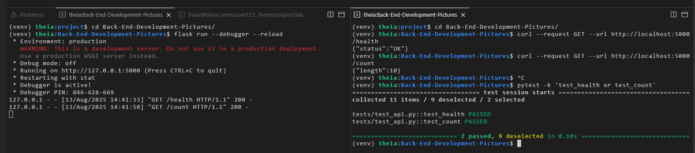
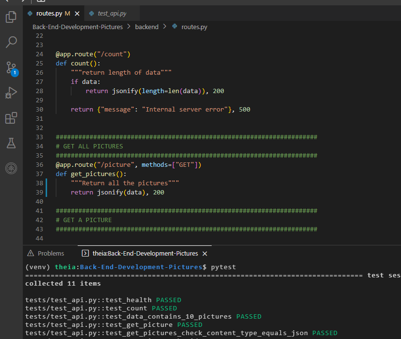
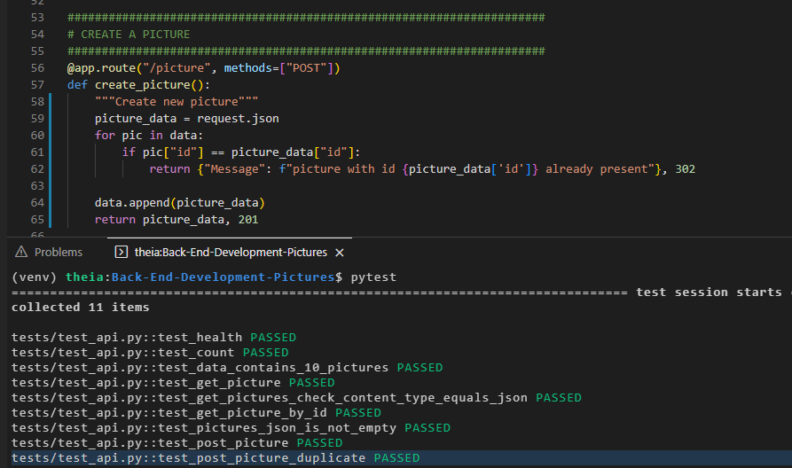
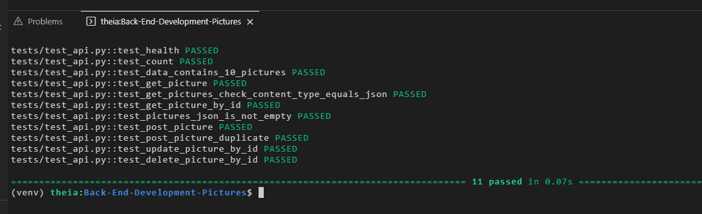
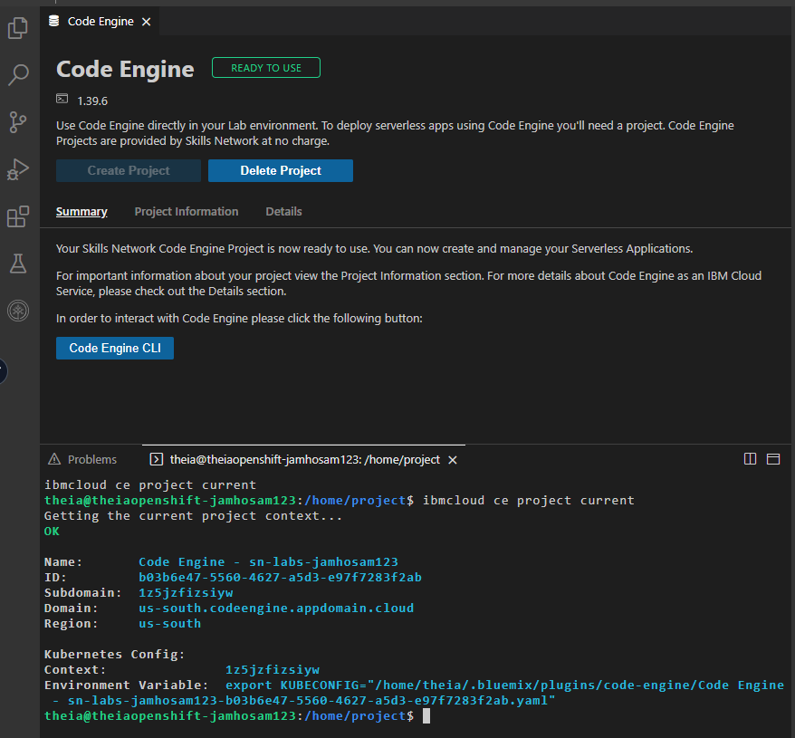
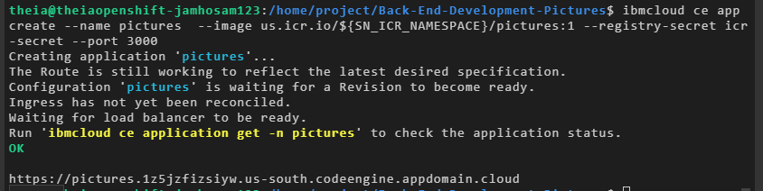
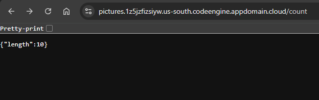

# IBM Back-end Application Development Capstone: Pictures Microservice


This repository contains the Flask-based microservice for handling event pictures in the IBM Back-end Application Development Capstone Project, part of the [IBM Back-End Development Professional Certificate](https://www.coursera.org/professional-certificates/ibm-backend-development) on Coursera. It implements a RESTful API to manage URLs of pictures from past events, following Test-Driven Development (TDD) principles. This microservice integrates with the main Django application and the Songs microservice to form a complete event management system for a fictional music band website.

## Project Overview

As the first microservice in the capstone, this component focuses on storing and retrieving picture URLs. Key features include:
- RESTful endpoints for CRUD operations on picture resources.
- Health and count endpoints for monitoring.
- Integration with cloud storage (simulated via dummy data).

This is **Part 1** of the capstone project. For the full architecture:
- [Back-End-Development-Songs](https://github.com/HossamJa/Back-End-Development-Songs): Part 2 - Songs Microservice.
- [Back-end-Development-Capstone](https://github.com/HossamJa/Back-end-Development-Capstone): Part 3 - Main Django Application and integration.

The overall project allows users to view pictures from past events, song lyrics, upcoming concerts, and manage registrations.

## Accomplishments in This Module

Completed in Module 1: Getting Started (Flask-based service development).
- Initialized development environment from a GitHub template.
- Implemented endpoints: `/health`, `/count`, `/picture` (GET/POST/PUT/DELETE), `/picture/<id>` (GET/PUT/DELETE).
- Passed all pytest unit tests for API functionality.
- Evidence screenshots:
  
  - **Health and Count Passing**
    

  - **GET Pictures Passing**
  - 

  - **POST Picture Passing**
    
 
  - **DELETE Picture Passing**
    
  
  ### Deployment screenshots from Module 4:
    
    **Deploy Pictures to Code Engine**
    
 
    **Application URL**
    
 
    **Count Endpoint in Browser**
    

## Technologies Used

- **Framework**: Flask for REST API development.
- **Testing**: Pytest for TDD.
- **Deployment**: Docker, IBM Code Engine (serverless).

## Installation and Setup

1. Clone the repository:
   ```
   git clone https://github.com/HossamJa/Back-End-Development-Pictures.git
   ```
2. Navigate to the directory:
   ```
   cd Back-End-Development-Pictures
   ```
3. Set up the environment:
   ```
   bash ./bin/setup.sh
   ```
4. Install dependencies:
   ```
   pip install -r requirements.txt
   ```
5. Run the application locally:
   ```
   flask run
   ```
6. Test endpoints (e.g., via curl):
   ```
   curl http://localhost:5000/health
   ```

## Deployment

- Containerize with Docker: `docker build -t pictures .`
- Deploy to IBM Code Engine.
- For full integration, deploy alongside the [Songs microservice](https://github.com/HossamJa/Back-End-Development-Songs) and [main Django app](https://github.com/HossamJa/Back-end-Development-Capstone).

## License

Licensed under the Apache License 2.0 - see the [LICENSE](LICENSE) file for details.

## Acknowledgments

- IBM and Coursera for the Back-End Development Professional Certificate.
